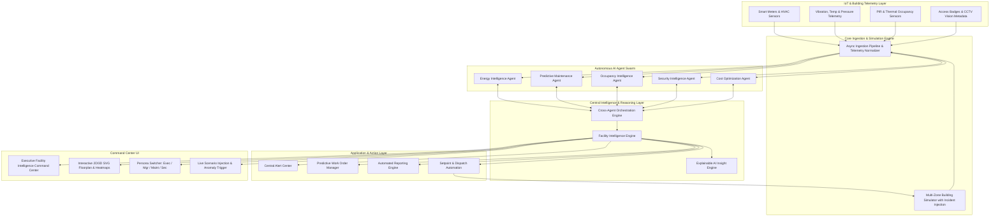

# Agentic FacilityOps AI Platform

> **Next-Generation Autonomous Digital Operating System for Modern Facilities & Smart Buildings**  
> *Collect → Understand → Correlate → Predict → Recommend → Optimize*


---

## 1. Executive Vision

The **Agentic FacilityOps AI Platform** transcends conventional passive building monitoring. It serves as a unified **digital nervous system** that continuously answers:

> **“What is happening, why is it happening, what is likely to happen next, and what should the facility team do?”**

By uniting **Energy Intelligence, Predictive Maintenance, Occupancy, Security, Cost Optimization, and ESG Sustainability** through a central **Cross-Agent Orchestration Engine**, the platform converts raw IoT sensor telemetry into explainable, causal intelligence and prescriptive actions.



---

## 2. Core Pillars & Specialized AI Agents

### ⚡ 1. Energy Intelligence Agent (`agt_energy_01`)
* **Real-Time Utility Monitoring**: Continuous tracking of electrical power draw (kW), peak demand (kW), water consumption (GPM & gallons), and HVAC efficiency.
* **HVAC Performance**: Chiller and AHU Coefficient of Performance (COP) monitoring and degradation tracking.
* **Water Leak Detection**: Detects abnormal non-pulsed flow deviations during unpopulated off-hours.
* **Carbon Tracking**: Computes real-time Scope 2 grid emissions ($0.385\text{ kg CO}_2\text{e/kWh}$).
* **Primary Visualization**: **ENERGY DISTRIBUTION** (HVAC, Lighting, IT Computing, Hydronic Pumps, Plug Loads).

### 🔧 2. Predictive Maintenance Agent (`agt_maint_02`)
* **Asset Condition Scoring**: Multivariate health score (0–100) evaluating vibration RMS harmonics, operating temperatures, and running hours across 50+ industrial assets.
* **Failure Forecasting**: Failure probability percentage, Remaining Useful Life (RUL hours), and failure window forecasts.
* **Root-Cause Explainability**: Explains *why* equipment degrades (e.g. inner race bearing spalling, fan belt slip).
* **Predictive Work Orders**: Full lifecycle dispatch (Open → Assigned → In Progress → Completed) with MTBF ($4,250\text{ hrs}$) and MTTR ($3.2\text{ hrs}$) tracking.
* **Primary Visualization**: **EQUIPMENT HEALTH DISTRIBUTION** (Healthy, Good, Warning, Critical).

### 👥 3. Occupancy Intelligence Agent (`agt_occupancy_03`)
* **Multi-Floor Heatmaps**: Interactive SVG architectural plans across Floors 1–5 and 24 zones.
* **Space Utilization Analytics**: Tracks crowded zones ($>80\%$), normal ($35\text{--}80\%$), low ($5\text{--}35\%$), and empty ($<5\%$) rooms.
* **Visitor Tracking**: Active visitor headcount and zone dwell times.
* **Primary Visualization**: **ZONE OCCUPANCY DISTRIBUTION**.

### 🛡️ 4. Security Intelligence Agent (`agt_security_04`)
* **Access Control Monitoring**: Electronic turnstiles, biometric mantraps, and card reader ingress events ($3,840+\text{ swipes/day}$).
* **CCTV AI Computer Vision**: Ingests automated video analytics metadata (tailgating, loitering, PPE compliance).
* **Zone Classification**: Enforces access policy across Public, Operational, Restricted, and High-Security zones.

### 💰 5. Cost Optimization Agent (`agt_cost_05`)
* **Financial Intelligence**: Evaluates time-of-use utility tariffs (Peak: $\$0.245\text{/kWh}$, Standard: $\$0.165\text{/kWh}$, Off-Peak: $\$0.098\text{/kWh}$).
* **Daily Run Cost**: Tracks real-time operating expense across energy, maintenance, water, operations, and depreciation.
* **ROI & Savings Tracking**: Realized monthly savings vs. untapped potential savings from AI recommendations.
* **Primary Visualization**: **COST DISTRIBUTION** (Energy | Maintenance | Utilities | Operations | Equipment | Other).

---

## 3. The Core Differentiator: Cross-Agent Orchestration

Rather than displaying disconnected dashboards, all agents communicate through the **Cross-Agent Orchestration Engine**:

| Cross-Agent Pair | Operational Trigger & Telemetry | Multi-Agent AI Synthesis | Unified Prescriptive Intervention |
| :--- | :--- | :--- | :--- |
| **ENERGY ↔ MAINTENANCE** | Chiller 2 vibration RMS reaches $4.85\text{ mm/s}$ while electrical power spikes $+28\%$ ($432\text{ kW}$). | Mechanical friction from bearing spalling is converting electricity directly into waste heat and motor strain. | Dispatches mechanical overhaul work order; stages Chiller 3 to prevent $\$24,500$ motor burnout. |
| **ENERGY ↔ OCCUPANCY** | Executive Briefing Room VAV box cooling airflow at $100\%$ ($42\text{ kW}$) while PIR confirms $0$ occupants for $180\text{ mins}$. | Zone cooling was left running after a canceled meeting, conditioning an empty $6,000\text{ sq ft}$ hall. | Executes automated thermal setback ($21^\circ\text{C} \to 24^\circ\text{C}$), saving $\$1,450\text{/mo}$. |
| **OCCUPANCY ↔ SECURITY** | PIR sensors detect motion inside Tier-4 Data Center ($2$ occupants) with zero authorized badge swipes. | Physical breach detected in high-security zone without electronic authorization. | Locks down zone access portals, auto-positions PTZ cameras, and dispatches rapid security patrol. |
| **MAINTENANCE ↔ COST** | Asset failure probability reaches $84\%$ within a $4$-day window. | Running to catastrophic failure $(\$185,000)$ vs planned preventative overhaul $(\$8,400)$. | Approves scheduled work order during weekend window, yielding $\$176,600$ capital avoidance. |
| **ENERGY ↔ COST** | Building demand nears $1,685\text{ kW}$ during $14:00$ peak pricing tariff window. | High likelihood of triggering a $\$5,400$ monthly peak demand utility penalty. | Initiates pre-cooling strategy and trims non-critical ventilation loads. |

---

## 4. Explainable AI Architecture (5 Pillars)

Every insight generated in the **AI Insight Center** implements a strict 5-pillar explainability framework:

1. **INSIGHT**: *What happened?* (e.g. Centrifugal Chiller 2 bearing vibration surged to $4.85\text{ mm/s}$.)
2. **WHY**: *Why did it happen?* (e.g. FFT vibration shows peak amplitude at ball-pass inner ring frequency BPFI.)
3. **RISK**: *What happens if no action is taken?* (e.g. Impending bearing seizure will trip cooling plant during peak hours, causing $\$65,000$ in damages.)
4. **RECOMMENDATION**: *What should be done?* (e.g. Stage backup Chiller 3 and perform ultrasonic grease injection within 48 hours.)
5. **IMPACT**: *What is the expected benefit?* (e.g. Prevents catastrophic breakdown and saves $\$18,400$ in emergency downtime.)

---

## 5. Unified Facility Health Score

The platform generates an executive composite score weighted across all operational domains:

$$\text{Facility Health} = 0.20 E + 0.25 M + 0.15 O + 0.15 S + 0.15 C + 0.10 U$$

* $E$: Energy Efficiency Score ($0\text{--}100$)
* $M$: Equipment Health Index ($0\text{--}100$)
* $O$: Space Utilization Score ($0\text{--}100$)
* $S$: Security Compliance Rating ($0\text{--}100$)
* $C$: Cost Efficiency Score ($0\text{--}100$)
* $U$: Sustainability & ESG Rating ($0\text{--}100$)

---

## 6. Quickstart & Installation

### Prerequisites
* Python 3.10+ (Tested on Python 3.13.2)
* No Node.js or external build tool required!

### Step 1: Install Dependencies
```bash
python -m pip install -r requirements.txt
```

### Step 2: Launch Platform
```bash
python run.py
```

### Step 3: Open in Browser
Navigate to:
```
http://127.0.0.1:8000
```

* **API Swagger Documentation**: `http://127.0.0.1:8000/docs`
* **Live WebSocket Stream**: `ws://127.0.0.1:8000/ws/live`

---

## 7. Interactive Incident Testing (Anomaly Injection Lab)

The platform includes an integrated **Anomaly Injection Toolbar** at the top of the interface:

1. **Chiller 2 Bearing Overheat & Vibration (Critical)**:
   * Spikes CH-02 vibration to $4.85\text{ mm/s}$ and temperature to $68.5^\circ\text{C}$.
   * Drops health score to $41.5\%$ (Critical).
   * Spikes power draw by $+120\text{ kW}$.
   * Triggers **ENERGY ↔ MAINTENANCE** and **MAINTENANCE ↔ COST** correlations.
2. **Data Center Unauthenticated Intrusion (Critical)**:
   * Injects motion in Tier-4 Data Center (Zone `Z-F5-01`) with zero badge swipes.
   * Triggers **OCCUPANCY ↔ SECURITY** breach alarm.
3. **Rooftop Cooling Tower Water Main Leak (High)**:
   * Spikes makeup water draw to $78.4\text{ GPM}$.
   * Triggers hydraulic leak alarm and **ENERGY ↔ COST** waste warnings.
4. **Peak Tariff Demand Surcharge Spike (High)**:
   * Pushes building power to $1,685\text{ kW}$ during peak pricing.
5. **Nominal Baseline (Reset)**:
   * Restores all assets and zones to pristine operating health.

---

## 8. Verification & Test Suite

Run the full automated test suite covering all simulation models, agents, cross-agent rules, and REST/WebSocket endpoints:

```bash
python -m unittest discover tests
```

* **19 tests run**: `test_facilityops.py` (11 tests) + `test_api_endpoints.py` (8 tests).
* Pass rate: **100% (19/19 OK)**.

---

## 9. System Topology

* **Facility**: Apex Tower Global HQ (285,000 sq.ft)
* **Floors**: 5 distinct building levels:
  * **Level 01**: Main Atrium, Visitor Cafeteria, Logistics Dock, Security Ops Center, Electrical Ingress
  * **Level 02**: Hardware R&D Lab Alpha & Beta, Cleanroom, Engineering Core
  * **Level 03**: Operations Open Office North & South, Auditorium & Conference Hub
  * **Level 04**: Executive Boardroom, C-Suite Offices, Strategy Briefing Room, Private Terrace
  * **Level 05**: Mission-Critical Tier-4 Data Center, UPS Battery Room, Chiller Plant Penthouse, Cooling Towers
* **Assets**: 50+ industrial assets (Centrifugal & Mag-Bearing Chillers, AHUs, Boilers, Pumps, Transformers, Switchgear, Elevators, Generators).
